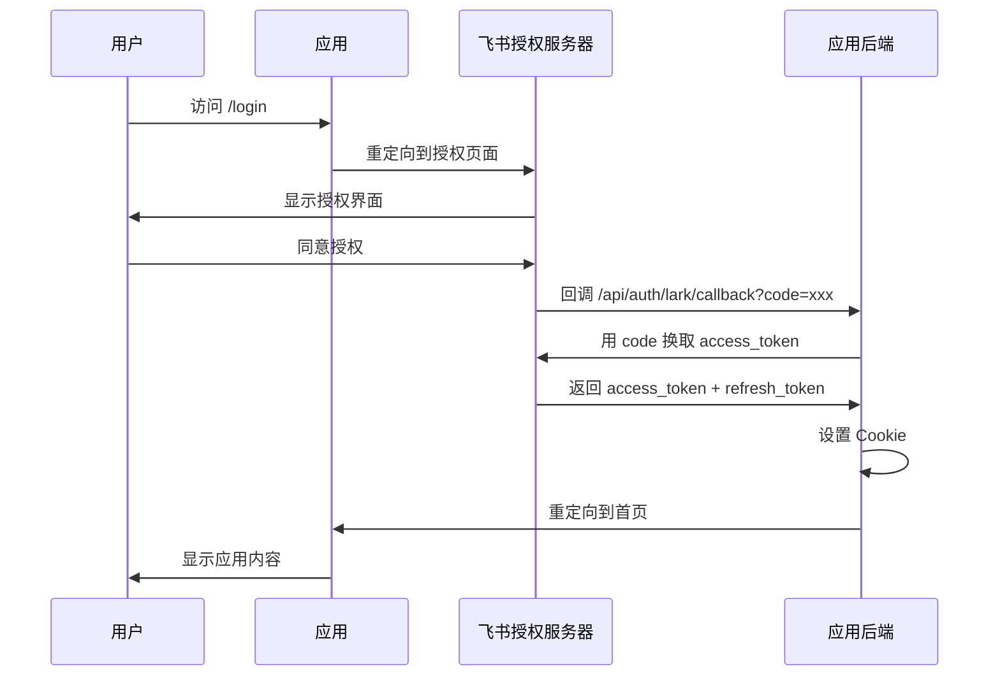
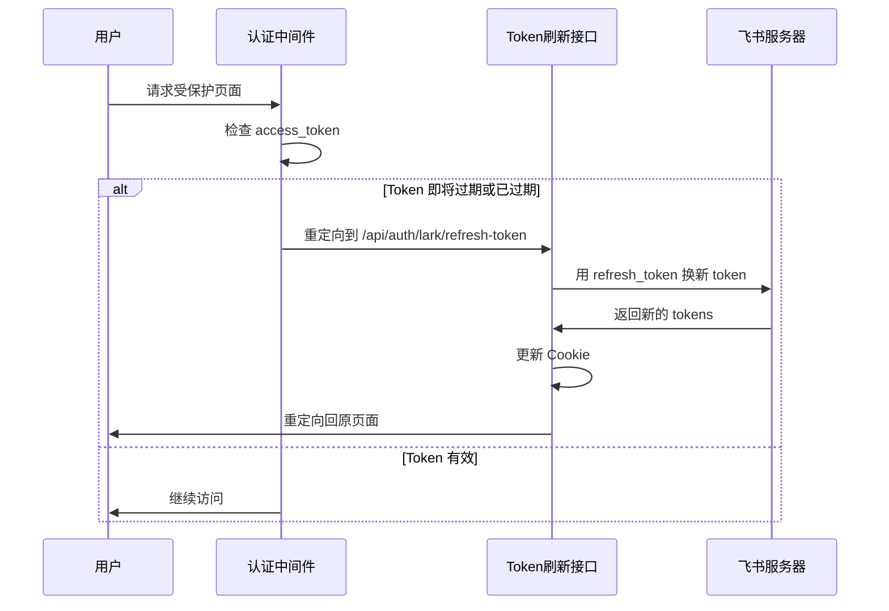

# 飞书(Lark)登录认证实现指南（优化版）

本文档详细说明了如何实现飞书 OAuth 2.0 登录和自动刷新功能，**适用于任何 Node.js 后端框架**（Express、SvelteKit、Next.js 等）。

---

## 📋 目录

1. [认证流程概述](#认证流程概述)
2. [核心概念](#核心概念)
3. [配置信息](#配置信息)
4. [详细实现步骤](#详细实现步骤)
5. [关键代码解析](#关键代码解析)
6. [常见问题与解决方案](#常见问题与解决方案)
7. [AI 实现检查清单](#ai-实现检查清单)

---

## 认证流程概述

飞书登录采用标准的 OAuth 2.0 授权码流程:



### Token 刷新流程



---

## 核心概念

### ⚠️ 关键要点（必读！）

#### 1. redirect_uri 必须完全一致

这是最容易出错的地方！以下三个地方的 `redirect_uri` **必须完全一致**：

1. **飞书开放平台配置**
2. **发起授权时的 redirect_uri 参数**
3. **换取 token 时的 redirect_uri 参数**

**错误示例**：
```javascript
// ❌ 动态生成，可能导致不一致
const redirectUri = `${req.protocol}://${req.get('host')}/api/auth/lark/callback`;
```

**正确示例**：
```javascript
// ✅ 从环境变量读取，确保一致
const REDIRECT_URI = process.env.FEISHU_REDIRECT_URI;
```

#### 2. 飞书 API 返回数据结构

⚠️ **重要**：飞书 OAuth 2.0 API 的返回格式可能有两种：

**格式 1（标准格式）**：
```json
{
  "code": 0,
  "msg": "success",
  "data": {
    "access_token": "u-xxx",
    "refresh_token": "ur-xxx",
    "expires_in": 7200,
    "refresh_token_expires_in": 2592000
  }
}
```

**格式 2（直接格式）**：
```json
{
  "access_token": "u-xxx",
  "refresh_token": "ur-xxx",
  "expires_in": 7200,
  "refresh_token_expires_in": 2592000
}
```

**你的代码必须兼容两种格式！**

#### 3. 环境变量 vs 硬编码

❌ **不要硬编码凭证**：
```javascript
const clientId = 'cli_a9a56a66ddf95bc8';  // ❌ 硬编码
```

✅ **使用环境变量**：
```javascript
const clientId = process.env.FEISHU_APP_ID;  // ✅ 从 .env 读取
```

---

## 配置信息

### 环境变量

创建 `.env` 文件：

```bash
# 飞书应用配置
# 请前往飞书开放平台创建应用并获取以下信息
# https://open.feishu.cn/app

# 应用 App ID
FEISHU_APP_ID="cli_xxxxxxxxxx"

# 应用 App Secret
FEISHU_APP_SECRET="xxxxxxxxxxxxxxxx"

# ⚠️ 重要：重定向 URI 必须与飞书开放平台配置完全一致！
# 本地开发（HTTP）：http://localhost:3000/api/auth/lark/callback
# 本地开发（HTTPS）：https://localhost:3000/api/auth/lark/callback
# 生产环境使用你的实际域名
FEISHU_REDIRECT_URI=http://localhost:3000/api/auth/lark/callback

# 开发环境标识
NODE_ENV=development
```

### Cookie 配置

```javascript
// Cookie 名称常量
const COOKIE = {
  accessToken: 'feishu_access_token',
  refreshToken: 'feishu_refresh_token',
};
```

### 飞书开放平台配置

1. 登录飞书开放平台：https://open.feishu.cn/app
2. 创建或选择应用
3. 在「安全设置」→「重定向 URL」中添加：
   ```
   http://localhost:3000/api/auth/lark/callback
   ```
4. 复制 App ID 和 App Secret 到 `.env` 文件

---

## 详细实现步骤

### 步骤 1: 创建飞书 API 服务层

创建 `services/lark-service.js`：

```javascript
/**
 * 飞书 API 服务层
 */

require('dotenv').config();

// ⚠️ 从环境变量读取凭证，不要硬编码！
const LARK_LOGIN_CLIENT_ID = process.env.FEISHU_APP_ID;
const LARK_LOGIN_CLIENT_SECRET = process.env.FEISHU_APP_SECRET;
const REDIRECT_URI = process.env.FEISHU_REDIRECT_URI;

// 验证配置
if (!LARK_LOGIN_CLIENT_ID || !LARK_LOGIN_CLIENT_SECRET || !REDIRECT_URI) {
    console.error('❌ 缺少必要的环境变量配置！');
    console.error('请检查 .env 文件中的以下配置：');
    console.error('- FEISHU_APP_ID');
    console.error('- FEISHU_APP_SECRET');
    console.error('- FEISHU_REDIRECT_URI');
    process.exit(1);
}

/**
 * 飞书 API 封装
 */
const larkApi = {
    /**
     * 验证授权码并获取 Token
     * 
     * ⚠️ 重要：redirect_uri 必须与飞书后台配置完全一致！
     */
    async verifyAuthCode(code) {
        const apiUrl = new URL('https://open.feishu.cn/open-apis/authen/v2/oauth/token');

        // 使用 URLSearchParams 构建请求参数
        apiUrl.searchParams.set('client_id', LARK_LOGIN_CLIENT_ID);
        apiUrl.searchParams.set('client_secret', LARK_LOGIN_CLIENT_SECRET);
        apiUrl.searchParams.set('grant_type', 'authorization_code');
        apiUrl.searchParams.set('code', code);
        // 使用环境变量中的固定 URI，确保与飞书后台配置一致
        apiUrl.searchParams.set('redirect_uri', REDIRECT_URI);

        console.log('🔄 验证授权码，换取 token...');
        console.log('📍 使用重定向URI:', REDIRECT_URI);

        const response = await fetch(apiUrl, {
            method: 'POST',
            headers: {
                'Content-Type': 'application/json; charset=utf-8',
            },
        });

        const data = await response.json();

        if (data.code === 0 || data.access_token) {
            console.log('✅ Token 获取成功');
        } else {
            console.error('❌ Token 获取失败:', data);
        }

        return data;
    },

    /**
     * 刷新 Token
     */
    async refreshToken(refreshToken) {
        console.log('🔄 刷新 access_token...');

        const response = await fetch('https://open.feishu.cn/open-apis/authen/v2/oauth/token', {
            method: 'POST',
            headers: {
                'Content-Type': 'application/json; charset=utf-8',
            },
            body: JSON.stringify({
                client_id: LARK_LOGIN_CLIENT_ID,
                client_secret: LARK_LOGIN_CLIENT_SECRET,
                grant_type: 'refresh_token',
                refresh_token: refreshToken,
            }),
        });

        const data = await response.json();

        if (data.code === 0 || data.access_token) {
            console.log('✅ Token 刷新成功');
        } else {
            console.error('❌ Token 刷新失败:', data);
        }

        return data;
    },

    /**
     * 获取用户信息
     */
    async getUserInfo(accessToken) {
        console.log('👤 获取用户信息...');

        const response = await fetch('https://open.feishu.cn/open-apis/authen/v1/user_info', {
            headers: {
                'Authorization': `Bearer ${accessToken}`,
            },
        });

        const data = await response.json();

        if (data.code === 0 || data.name) {
            console.log('✅ 用户信息获取成功');
        } else {
            console.error('❌ 用户信息获取失败:', data);
        }

        return data;
    },
};

module.exports = {
    larkApi,
    LARK_LOGIN_CLIENT_ID,
    LARK_LOGIN_CLIENT_SECRET,
    REDIRECT_URI,
};
```

**关键改进**：
- ✅ 从环境变量读取配置
- ✅ 启动时验证配置完整性
- ✅ 使用统一的 `REDIRECT_URI` 常量
- ✅ 兼容两种 API 返回格式

---

### 步骤 2: 创建认证路由处理器

创建 `routes/auth.js`：

```javascript
/**
 * 认证路由
 */

const express = require('express');
const { larkApi, REDIRECT_URI } = require('../services/lark-service');

const router = express.Router();

// Cookie 名称常量
const COOKIE = {
    accessToken: 'feishu_access_token',
    refreshToken: 'feishu_refresh_token',
};

/**
 * OAuth 回调处理
 * 
 * 飞书授权后会重定向到这个地址，URL 中包含 code 参数
 */
router.get('/lark/callback', async (req, res) => {
    const { code } = req.query;

    console.log('📥 收到 OAuth 回调');
    console.log('Code:', code);
    console.log('📍 配置的重定向URI:', REDIRECT_URI);

    if (!code) {
        return res.status(400).json({
            code: 400,
            msg: 'code is empty',
        });
    }

    try {
        // 用授权码换取 token
        const tokenData = await larkApi.verifyAuthCode(code);

        console.log('🔍 飞书返回的完整数据:', JSON.stringify(tokenData, null, 2));

        // ⚠️ 兼容两种数据格式
        let access_token, refresh_token, expires_in, refresh_token_expires_in;

        if (tokenData.data) {
            // 格式 1：数据在 data 字段中
            ({ access_token, refresh_token, expires_in, refresh_token_expires_in } = tokenData.data);
        } else {
            // 格式 2：数据直接在顶层
            ({ access_token, refresh_token, expires_in, refresh_token_expires_in } = tokenData);
        }

        if (!access_token || !refresh_token) {
            console.error('❌ Token 验证失败，缺少必要字段');
            console.error('access_token:', access_token);
            console.error('refresh_token:', refresh_token);
            return res.status(400).json({
                code: 400,
                msg: 'verify auth code failed - missing tokens',
                detail: tokenData,
            });
        }

        // 设置 Cookie（HttpOnly, Secure）
        res.cookie(COOKIE.accessToken, access_token, {
            maxAge: expires_in * 1000,
            httpOnly: true,
            secure: req.protocol === 'https',
            sameSite: 'lax',
        });

        res.cookie(COOKIE.refreshToken, refresh_token, {
            maxAge: refresh_token_expires_in * 1000,
            httpOnly: true,
            secure: req.protocol === 'https',
            sameSite: 'lax',
        });

        console.log('✅ Cookie 设置成功');
        console.log('Access Token 有效期:', expires_in, '秒');
        console.log('Refresh Token 有效期:', refresh_token_expires_in, '秒');

        // 重定向到首页
        res.redirect('/');

    } catch (error) {
        console.error('❌ 回调处理失败:', error);
        res.status(500).json({
            code: 500,
            msg: 'internal server error',
            error: error.message,
        });
    }
});

/**
 * Token 刷新处理
 */
router.get('/lark/refresh-token', async (req, res) => {
    const { redirect_url } = req.query;
    const refreshToken = req.cookies[COOKIE.refreshToken];

    console.log('🔄 收到 Token 刷新请求');

    if (!refreshToken) {
        console.error('❌ Refresh token 不存在');
        return res.status(400).json({
            code: 400,
            msg: 'refresh token is empty',
        });
    }

    try {
        const tokenData = await larkApi.refreshToken(refreshToken);

        console.log('🔍 刷新Token返回的完整数据:', JSON.stringify(tokenData, null, 2));

        // ⚠️ 兼容两种数据格式
        let access_token, refresh_token, expires_in, refresh_token_expires_in;

        if (tokenData.data) {
            ({ access_token, refresh_token, expires_in, refresh_token_expires_in } = tokenData.data);
        } else {
            ({ access_token, refresh_token, expires_in, refresh_token_expires_in } = tokenData);
        }

        if (!access_token || !refresh_token) {
            console.error('❌ Token 刷新失败，缺少必要字段');

            // refresh token 被撤销（code 20064），清除 Cookie 并重定向到登录
            if (tokenData.code === 20064) {
                console.error('⚠️ Refresh token 已被撤销，清除 Cookie');
                res.clearCookie(COOKIE.accessToken);
                res.clearCookie(COOKIE.refreshToken);
                return res.redirect('/login');
            }

            return res.status(400).json({
                code: 400,
                msg: 'refresh token failed',
                detail: tokenData,
            });
        }

        // 更新 Cookie
        res.cookie(COOKIE.accessToken, access_token, {
            maxAge: expires_in * 1000,
            httpOnly: true,
            secure: req.protocol === 'https',
            sameSite: 'lax',
        });

        res.cookie(COOKIE.refreshToken, refresh_token, {
            maxAge: refresh_token_expires_in * 1000,
            httpOnly: true,
            secure: req.protocol === 'https',
            sameSite: 'lax',
        });

        console.log('✅ Token 刷新成功');

        // 重定向回原页面
        res.redirect(redirect_url || '/');

    } catch (error) {
        console.error('❌ Token 刷新失败:', error);
        res.status(500).json({
            code: 500,
            msg: 'internal server error',
            error: error.message,
        });
    }
});

/**
 * 获取用户信息接口
 */
router.get('/user-info', async (req, res) => {
    const accessToken = req.cookies[COOKIE.accessToken];

    if (!accessToken) {
        return res.status(401).json({
            code: 401,
            msg: 'not authenticated',
        });
    }

    try {
        const userData = await larkApi.getUserInfo(accessToken);

        // ⚠️ 兼容两种数据格式
        if (userData.code === 0 || userData.name) {
            res.json({
                code: 0,
                data: userData.data || userData,
            });
        } else {
            res.status(400).json({
                code: 400,
                msg: 'get user info failed',
                detail: userData,
            });
        }

    } catch (error) {
        console.error('❌ 获取用户信息失败:', error);
        res.status(500).json({
            code: 500,
            msg: 'internal server error',
            error: error.message,
        });
    }
});

module.exports = router;
```

**关键改进**：
- ✅ 兼容两种 API 返回格式
- ✅ 详细的调试日志
- ✅ 使用统一的 `REDIRECT_URI`
- ✅ 完善的错误处理

---

### 步骤 3: 创建服务器和登录路由

创建 `server.js`：

```javascript
/**
 * Express 服务器主文件
 */

const express = require('express');
const cookieParser = require('cookie-parser');
const cors = require('cors');
const path = require('path');
require('dotenv').config();

const authRoutes = require('./routes/auth');
const { LARK_LOGIN_CLIENT_ID, REDIRECT_URI } = require('./services/lark-service');

const app = express();
const PORT = process.env.PORT || 3000;

// 中间件
app.use(cors());
app.use(express.json());
app.use(express.urlencoded({ extended: true }));
app.use(cookieParser());

// 静态文件服务
app.use(express.static(path.join(__dirname)));

// 认证 API 路由
app.use('/api/auth', authRoutes);

/**
 * 登录页面路由
 * 
 * 直接重定向到飞书授权页面
 */
app.get('/login', (req, res) => {
    const scope = 'auth:user.id:read offline_access';

    // 构建飞书授权 URL
    const authUrl = new URL('https://accounts.feishu.cn/open-apis/authen/v1/authorize');
    authUrl.searchParams.set('client_id', LARK_LOGIN_CLIENT_ID);
    authUrl.searchParams.set('redirect_uri', REDIRECT_URI);  // 使用统一的配置
    authUrl.searchParams.set('response_type', 'code');
    authUrl.searchParams.set('scope', scope);

    console.log('🚀 重定向到飞书授权页面');
    console.log('📍 重定向地址:', REDIRECT_URI);

    res.redirect(authUrl.toString());
});

/**
 * 首页路由
 */
app.get('/', (req, res) => {
    res.sendFile(path.join(__dirname, 'index.html'));
});

// 启动服务器
app.listen(PORT, () => {
    console.log('');
    console.log('='.repeat(60));
    console.log('🚀 飞书登录后端服务已启动');
    console.log('='.repeat(60));
    console.log('');
    console.log('📍 服务地址: http://localhost:' + PORT);
    console.log('');
    console.log('🔐 OAuth 配置:');
    console.log('   Client ID:', LARK_LOGIN_CLIENT_ID);
    console.log('   重定向地址:', REDIRECT_URI);
    console.log('');
    console.log('📋 可用路由:');
    console.log('   GET  /                              - 首页');
    console.log('   GET  /login                         - 发起登录');
    console.log('   GET  /api/auth/lark/callback        - OAuth 回调');
    console.log('   GET  /api/auth/lark/refresh-token   - 刷新 Token');
    console.log('   GET  /api/auth/user-info            - 获取用户信息');
    console.log('');
    console.log('⚠️  请在飞书开放平台配置以下重定向地址:');
    console.log('   ' + REDIRECT_URI);
    console.log('');
    console.log('💡 提示：如果遇到 redirect_uri 错误：');
    console.log('   1. 检查 .env 中的 FEISHU_REDIRECT_URI');
    console.log('   2. 确保与飞书开放平台配置完全一致');
    console.log('   3. 注意协议（http/https）和端口号');
    console.log('');
    console.log('='.repeat(60));
    console.log('');
});
```

---

## 关键代码解析

### 1. 为什么需要兼容两种数据格式？

飞书 OAuth 2.0 API 的返回格式可能因版本或配置不同而有所差异：

```javascript
// ⚠️ 兼容两种数据格式
let access_token, refresh_token, expires_in, refresh_token_expires_in;

if (tokenData.data) {
    // 格式 1：标准格式，数据在 data 字段中
    ({ access_token, refresh_token, expires_in, refresh_token_expires_in } = tokenData.data);
} else {
    // 格式 2：直接格式，数据在顶层
    ({ access_token, refresh_token, expires_in, refresh_token_expires_in } = tokenData);
}
```

### 2. 为什么要统一管理 redirect_uri？

```javascript
// ❌ 错误：动态生成，可能导致不一致
const redirectUri = `${req.protocol}://${req.get('host')}/api/auth/lark/callback`;

// ✅ 正确：从环境变量读取，确保一致
const REDIRECT_URI = process.env.FEISHU_REDIRECT_URI;
```

**原因**：
- OAuth 2.0 安全机制要求授权请求、回调、换取 token 三个地方的 `redirect_uri` 必须完全一致
- 动态生成可能因协议（http/https）、端口、代理等因素导致不一致
- 使用环境变量可以确保所有地方使用同一个值

### 3. Cookie 安全设置

```javascript
res.cookie(COOKIE.accessToken, access_token, {
    maxAge: expires_in * 1000,      // 自动过期
    httpOnly: true,                 // 防止 XSS 攻击
    secure: req.protocol === 'https', // HTTPS 时启用
    sameSite: 'lax',               // 防止 CSRF 攻击
});
```

### 4. OAuth 授权范围

```javascript
const scope = 'auth:user.id:read offline_access';
```

- `auth:user.id:read`: 读取用户基本信息
- `offline_access`: 获取 refresh_token（关键！）

---

## 常见问题与解决方案

### Q1: redirect_uri 错误

**错误信息**：
```json
{
  "code": 10014,
  "msg": "invalid redirect_uri"
}
```

**解决方案**：
1. 检查 `.env` 中的 `FEISHU_REDIRECT_URI`
2. 检查飞书开放平台配置的回调地址
3. 确保两者**完全一致**（包括协议、端口、路径）

### Q2: Cannot read properties of undefined (reading 'access_token')

**原因**：代码假设数据在 `tokenData.data.access_token`，但实际可能直接在 `tokenData.access_token`

**解决方案**：使用兼容两种格式的代码（见上文）

### Q3: Client ID 不匹配

**症状**：服务器日志显示的 Client ID 与 `.env` 文件不一致

**解决方案**：
1. 检查代码中是否有硬编码的 Client ID
2. 确保从环境变量读取：`process.env.FEISHU_APP_ID`
3. 重启服务器

### Q4: 端口被占用

**错误信息**：
```
Error: listen EADDRINUSE: address already in use :::3000
```

**解决方案**：
```bash
# 杀掉占用端口的进程
lsof -ti:3000 | xargs kill -9

# 或者使用其他端口
PORT=3001 npm start
```

---

## AI 实现检查清单

当你指导 AI 在新项目中实现飞书登录时，请确保以下步骤：

### ✅ 前置准备

- [ ] 安装依赖: `express`, `cookie-parser`, `cors`, `dotenv`
- [ ] 准备飞书应用凭证（App ID 和 App Secret）
- [ ] 在飞书开放平台配置回调地址

### ✅ 配置阶段

- [ ] 创建 `.env` 文件并添加凭证
- [ ] **从环境变量读取配置，不要硬编码**
- [ ] 确保 `FEISHU_REDIRECT_URI` 与飞书后台配置一致

### ✅ 核心实现

- [ ] 创建 `services/lark-service.js` - 飞书 API 封装
  - [ ] 从环境变量读取配置
  - [ ] 实现 `verifyAuthCode` 方法
  - [ ] 实现 `refreshToken` 方法
  - [ ] 实现 `getUserInfo` 方法
  - [ ] **使用统一的 `REDIRECT_URI` 常量**

- [ ] 创建 `routes/auth.js` - 认证路由
  - [ ] 实现 `/lark/callback` 路由
  - [ ] 实现 `/lark/refresh-token` 路由
  - [ ] **兼容两种 API 返回格式**
  - [ ] 正确设置 Cookie 安全属性
  - [ ] 添加详细的调试日志

- [ ] 创建 `server.js` - 服务器主文件
  - [ ] 实现 `/login` 路由
  - [ ] 使用统一的 `REDIRECT_URI`
  - [ ] 添加启动日志

### ✅ 测试和调试

- [ ] 测试登录流程
- [ ] 查看服务器日志，确认 API 返回格式
- [ ] 测试 token 刷新
- [ ] 测试获取用户信息

### ✅ 关键提示

告诉 AI：

1. **不要硬编码凭证**，必须从环境变量读取
2. **redirect_uri 必须完全一致**，使用统一的常量
3. **兼容两种 API 返回格式**（`data` 字段或直接顶层）
4. **添加详细的调试日志**，方便排查问题
5. **Cookie 安全设置**：`httpOnly: true, secure: true`

---

## 总结

飞书登录的核心要点：

1. **OAuth 2.0 授权码流程**: 用户授权 → 获取 code → 换取 token
2. **redirect_uri 一致性**: 三个地方必须完全一致
3. **兼容 API 返回格式**: 处理两种可能的数据结构
4. **环境变量管理**: 不要硬编码凭证和配置
5. **安全存储**: 使用 HttpOnly Cookie 存储 token
6. **详细日志**: 方便调试和排查问题

按照本文档的步骤和最佳实践，可以避免常见的坑，快速实现稳定可靠的飞书登录功能。
